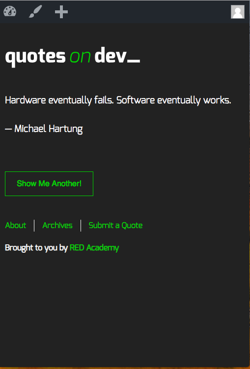

# Quotes 

A WordPress theme built by Tim Nguyen

## Screenshots

## Installation

### 1. Require SQL Database File

### 2. MAMP is running

### 3. Access to Wordpress and Gulp is running

## Built with

#### MAMP
#### Wordpress
#### Wordpress Rest API
#### Gulp
#### Visual Studio Code

## 
## Author

Tim Nguyen

## Personal learning

Learn to build WordPress theme on multiple pages following Wordpress Template Hierachy. Build theme that is responsive to Mobile, Tablet and Desktop Devices from Mobile first. Learn how to get data from Wordpress Rest API and maneuveur different functions of Wordpress. 

